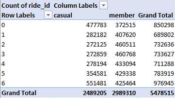
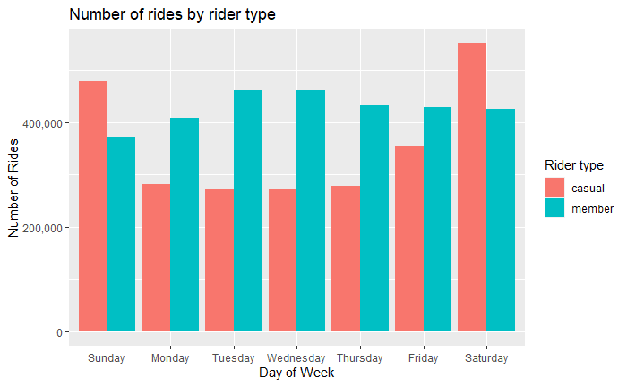
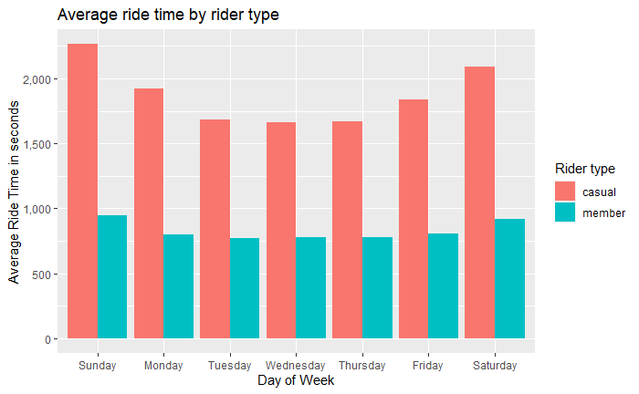
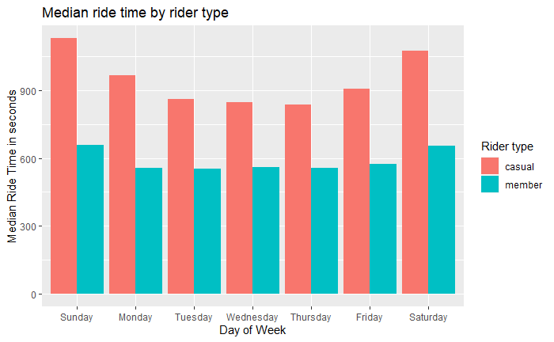
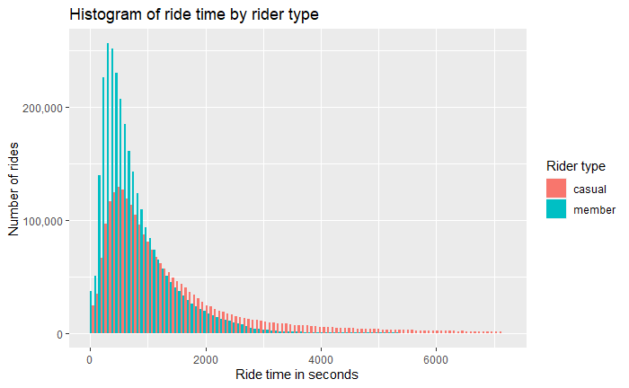

# Google Data Analytics Certificate Capstone Case Study
A Case Study on the bike-share company Divvy

## Business Task
To get more casual riders to purchase annual memberships.  

Question to answer: How do annual members and casual riders use Divvy bikes differently?  

By identifying how casual riders differ from members and the specific characteristics of members, we could identify some potential driving factors that lead consumers to purchase annual memberships. Once our analysis is complete, we can use the gathered insight to inform the development of a marketing campaign

## Data Source

Data Source

The data for the past 12 months is stored in 12 separate csv files.  The data is from 12/2020 to 11/2021
The data comes from a real bike-share company in Chicago called Divvy, and it is available under this license 

At first glance there is a small chunk of data missing for start and end stations. It is unclear whether the missing data is random or systematic. 

The data provides information on rideable type, start time, end time, start station, end station, and member type. The classification of member type will allow us to look for differences between annual members and casual riders.

## Processing Data

For spreadsheet analysis, I added ride_length and day_of_week columns to each of the csv files. Because there are over 5 million rows in total, we must use the Data Model function in Excel to consolidate the data and create a pivot table. 

For analysis in R Studio, I used tidyverse to consolidate all the csv files into one dataframe.

## Data Analysis

### Excel Data Model
From the data model in excel, we calculated:
- The mode day_of_week: **Saturday, 17.83% of all trips**
- The mean ride_length: **0:22:08**
- The max ride_length: **932:24:09**

There were some errors in the ride length column where the end time was earlier than the start time, resulting in negative ride lengths. I regarded these as errors and filtered them out.

### R Studio

For analysis in R Studio I also added a ride_length and day_of_week column and removed the entries where ride_length was negative. 

Similarly, I calculated the mean and median ride times and the number of rides for different rider types across the days of the week. 

Using ggplot, I visualized the mean and median ride times and the number of rides between rider types and across the days of the week

Looking at the number of rides broken down by day of the week, we see that members ride more during weekdays and casual riders ride more during the weekends. This suggests that casual riders use the service more for leisure and members likely use it for something more routine such as a commute to work or school. 

It seems that the ride times of casual riders vary much more than members. Calculating the **standard deviation** of the ride times between rider types confirms that. The sd of ride times for **casual riders is 15794.463 seconds** and for **members it is 1671.007 seconds.** The difference in standard deviations suggests that members use the service far more routinely

The distribution of ride lengths between casual riders and members are also quite different. The difference is visualized in this histogram, with the casual rider distribution being more skewed to the right and the member distribution having a higher peak. 

It is interesting to note that average and median ride time for casual riders greatly exceeds that of members across the board. This might be something to look into for further research. The number of rides made by casual members are also fairly consistent throughout the week, which could suggest some regularity in some casual riders’ use of the service. However, we cannot know for sure unless we have data on the usage by individual casual riders. With that additional information we may be able to identify and recommend the membership to a certain type of casual rider that uses the service with some regularity.

## Conclusion

Members and casual riders differ greatly in the number of rides they take and how long they ride for. The ride behavior of members is characterized by shorter but more consistent trips and more trips during the weekdays.

Given that members and casual riders likely use the service for different purposes, a marketing aimed at converting casual riders to members should focus on promoting the ways that members use the service to casual riders. For example, the campaign could emphasize the benefits of commuting to work or school with a bike-share service by showing the environmental impact of doing so. Then, it could also emphasize the savings made from converting to a membership if customers make a certain number of rides in a period of time.
